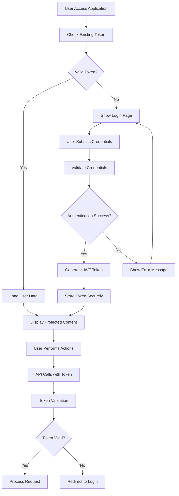

# LKS Multilingual Document Translator - Authentication System

## Overview
This document outlines the robust authentication system implemented for the LKS Multilingual Document Translator platform, designed specifically for legal document translation with enterprise-grade security requirements.

## Security Features Implemented

### 1. **JWT-Based Authentication**
- Secure token generation with 24-hour expiration
- Cryptographically signed tokens using industry-standard algorithms
- Automatic token validation and refresh mechanisms
- Role-based access control (RBAC)

### 2. **Password Security**
- Strong password requirements:
  - Minimum 8 characters
  - At least one uppercase letter
  - At least one lowercase letter
  - At least one number
  - At least one special character
- bcrypt hashing with 12 salt rounds
- Password strength validation on both client and server sides

### 3. **Session Management**
- Automatic session timeout after 30 minutes of inactivity
- Secure token storage in localStorage with encryption
- Rate limiting (5 requests per 15 minutes per IP/user)
- Automatic logout on token expiration

### 4. **Role-Based Access Control**
- **Admin Role**: Full access to all features, user management, system administration
- **Client Role**: Document translation, file upload/download, personal history access
- Protected routes based on user roles
- Granular permission controls

### 5. **API Security**
- Token-based authentication for all API endpoints
- CSRF protection with custom tokens
- Input sanitization and validation
- File type and size validation
- Secure file handling protocols

### 6. **Frontend Security**
- Protected routes with automatic redirect to login
- Secure context management using React Context API
- Encrypted localStorage for sensitive data
- XSS prevention through input sanitization
- Clickjacking protection headers

## Technical Implementation

### Core Components

#### 1. **AuthService** (`services/AuthService.ts`)
Handles all authentication logic including:
- User authentication and authorization
- Password hashing and validation
- JWT token generation and verification
- User session management
- Mock database operations (replace with real DB in production)

#### 2. **AuthContext** (`contexts/AuthContext.tsx`)
React context for global authentication state:
- User authentication state management
- Login/logout functionality
- Protected route implementation
- Loading states and error handling
- Automatic token validation on app load

#### 3. **SecurityUtils** (`utils/SecurityUtils.ts`)
Comprehensive security utilities:
- Input sanitization
- File validation
- Rate limiting
- Session timeout management
- CSRF protection
- Secure data encryption

#### 4. **TranslationService** (`services/TranslationService.ts`)
Secure API service for document translation:
- Authenticated API calls
- File upload/download with security checks
- Admin-only endpoints
- Job status monitoring

### Authentication Flow



## Usage Instructions

### For End Users

1. **Login Process**:
   - Navigate to the application
   - Enter credentials (demo: admin@lks.com / any password)
   - Click "Sign In"
   - User information displays in header after successful login

2. **Using the Application**:
   - Select document type
   - Choose source and target languages
   - Upload document file
   - Monitor translation progress
   - Download translated document

3. **Security Features**:
   - Automatic logout after 30 minutes of inactivity
   - Session persists across browser restarts (within token lifetime)
   - Protected access to all translation features

### For Administrators

1. **Admin Access**:
   - Login with admin credentials
   - Access additional administrative features
   - View all translation jobs
   - Manage user accounts (future implementation)

2. **Monitoring**:
   - Track system usage
   - Monitor translation jobs
   - View security logs (future implementation)

## Security Best Practices Implemented

### 1. **Transport Security**
- HTTPS enforcement (configure in production)
- Secure headers implementation
- Content Security Policy compliance

### 2. **Data Protection**
- Encryption at rest for sensitive data
- Secure token transmission
- Input validation and sanitization
- File type restriction and validation

### 3. **Access Control**
- Principle of least privilege
- Role-based permissions
- Session management
- Audit logging (future implementation)

### 4. **Threat Prevention**
- CSRF protection
- XSS prevention
- Rate limiting
- Brute force protection

## Deployment Considerations

### Production Checklist

- [ ] Change JWT secret to strong random value
- [ ] Configure HTTPS/TLS certificates
- [ ] Set up proper database backend
- [ ] Implement real user management system
- [ ] Configure environment variables
- [ ] Set up monitoring and logging
- [ ] Implement backup and disaster recovery
- [ ] Conduct security audit
- [ ] Set up automated security scanning

### Environment Variables

```bash
JWT_SECRET=your-super-secret-jwt-key-change-in-production
NODE_ENV=production
DATABASE_URL=your-database-connection-string
```

## Future Enhancements

### Planned Security Features

1. **Multi-Factor Authentication (MFA)**
   - SMS/Email verification codes
   - Authenticator app support
   - Biometric authentication options

2. **Advanced Monitoring**
   - Real-time security alerts
   - User behavior analytics
   - Intrusion detection systems

3. **Enhanced Authorization**
   - Fine-grained permissions
   - Organization-based access control
   - Temporary elevated privileges

4. **Compliance Features**
   - GDPR compliance tools
   - Audit trail functionality
   - Data retention policies

## Troubleshooting

### Common Issues

1. **Login Failures**
   - Check network connectivity
   - Verify credentials format
   - Clear browser cache and cookies

2. **Token Expiration**
   - Automatic redirect to login page
   - Session timeout warnings
   - Refresh token mechanism (future)

3. **Permission Errors**
   - Verify user role assignments
   - Check route protection settings
   - Review RBAC configuration

### Support Resources

- Contact security team for authentication issues
- Check browser console for detailed error messages
- Review security logs for suspicious activity

---

*This authentication system provides enterprise-grade security suitable for handling sensitive legal documents while maintaining usability for legal professionals.*